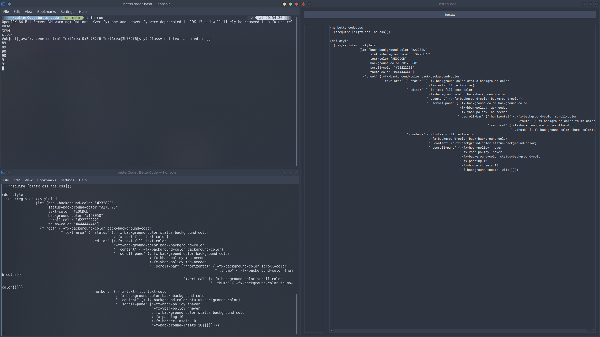

### Hi there 👋 I'm Vision

## Current Project: BetterCode
> A light text editor made in C++, using SDL2 for rendering, the immer library for immutable data structures and soon yaml-cpp.
> 
> Started November 19th 2020
> 
> Latest version: 0.5 pre-release
> 
> Current look, not functional yet (note terminal windows are just logging, not part of the app):

